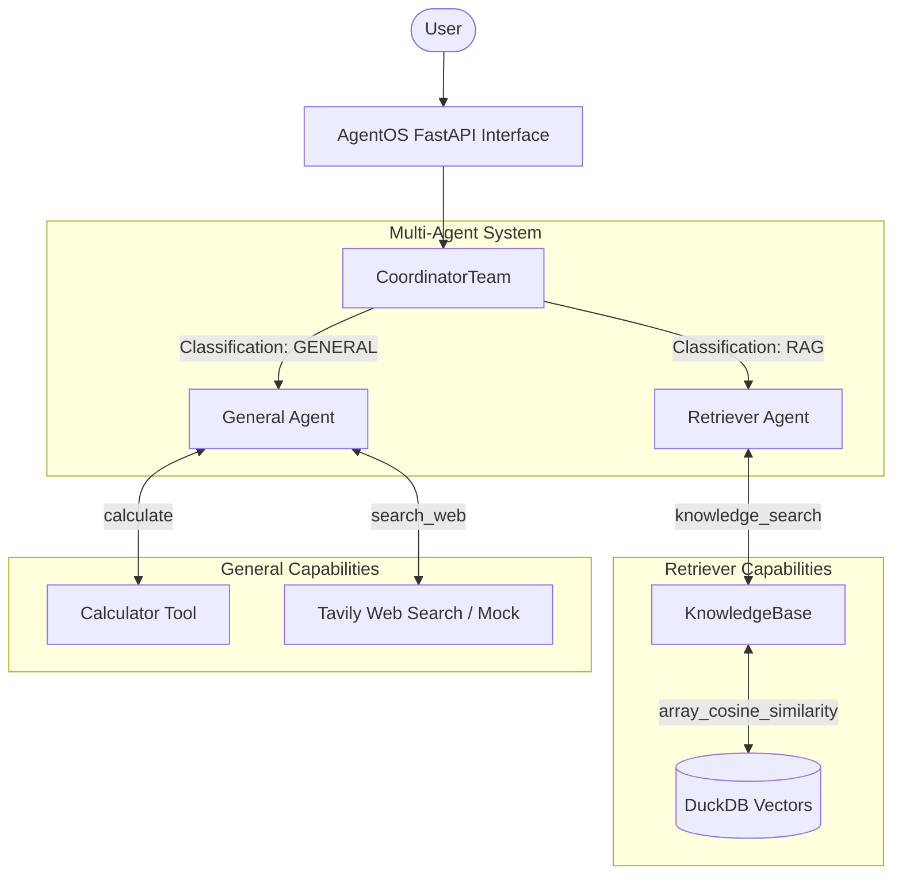

# AI Research Assistant

A multi-agent AI system designed to answer complex user queries by dynamically routing them to specialized agents capable of Retrieval-Augmented Generation (RAG) and structured tool usage.

## Architecture

The system utilizes an Orchestrator-Workers architecture powered by Agno's `Team` framework in `coordinate` mode.



---

## Setup & Execution

### Prerequisites
1. **Python 3.10+**
2. **API Keys**:
   - `OPENROUTER_API_KEY`: Required for LLMs (set in the `.env` file).
   - `TAVILY_API_KEY`: Optional for real web search (falls back to mocks if omitted).

### Installation
1. **Create and Activate Virtual Environment**:
   ```bash
   python -m venv .venv
   source .venv/bin/activate
   ```
2. **Install Dependencies**:
   ```bash
   pip install -r requirements.txt
   ```
3. **Configure Environment Variables**:
   Edit `.env` and fill in `OPENROUTER_API_KEY` (and `TAVILY_API_KEY` if available).

### Data Indexing
Before running the system, index the textbook PDF into the DuckDB vector store:
```bash
python -m src.knowledge.index
```
This loads the PDF document, chunks the text, computes embeddings locally using a SentenceTransformer model, and stores them in the DuckDB database.

### Running the System
The system is exposed as a FastAPI AgentOS instance:
```bash
python -m src.app
```
By default, the server runs on `http://localhost:8000`.

To chat with the agent team visually:
1. Keep the local server running.
2. Visit the [Agno Agent UI](https://os.agno.com) or `https://playground.agno.com`.
3. Add a new endpoint pointing to `http://localhost:8000`.

### Running Verification & Testing
1. **Run Unit Tests (Tools)**:
   ```bash
   python -m pytest tests/test_tools.py -v
   ```
   
2. **Run Query Evaluation Suite**:
   This runs 10 evaluation queries covering RAG precision, mathematical edge cases, and routing accuracy, and prints a summary report:
   ```bash
   python -m eval.eval_queries
   ```

---

## Detailed Design Decisions

### 1. Multi-Agent Orchestration (Agno Team in Coordinate Mode) vs. Prompt Chaining
- **Philosophy**: In simple agent setups, developers often use prompt chaining or hardcoded regex/if-else logic to route queries. This approach fails when tasks become dynamic or scale in scope.
- **Implementation**: We construct a `Team` using Agno's `coordinate` mode. The **Coordinator** is an LLM leader that assesses user intent, explicitly logs its classification reasoning and confidence, and dynamically dispatches work to the appropriate specialist agent.
- **Routing Protocol**:
  ```python
  team = Team(
      name="Research Team",
      mode="coordinate",
      members=[retriever_agent, general_agent],
      instructions=[
          "CLASSIFICATION (state this before delegating):",
          "Format: 'Classification: [RAG|GENERAL] -- Reason: [brief explanation]'",
          "Rate your confidence: HIGH, MEDIUM, LOW.",
          "Do NOT answer queries yourself -- always delegate to a specialist."
      ]
  )
  ```
- **Benefit**: This design decouples specialized agent logic from coordinator routing, making the system highly modular and scalable.

### 2. Manual DuckDB Vector Store vs. Managed Vector DB
- **Zero-Dependency Vector Search**: Instead of using third-party managed vector databases (like Pinecone) or external database servers, we implemented a custom in-process vector store directly in DuckDB using its native `array` datatype and vector similarity capabilities.
- **Under-the-Hood SQL Search**: Cosine similarity is computed directly inside the database using SQL queries:
  ```sql
  SELECT content, page_num, source,
         array_cosine_similarity(embedding, $1::FLOAT[384]) as score
  FROM document_chunks
  ORDER BY score DESC
  LIMIT $2
  ```
- **Transparency**: Rather than hiding vector calculations behind an ORM, this raw SQL implementation verifies exact similarity scoring, keeping the project database fully local, in-process, and lightweight.

### 3. Safe Execution & Fallbacks in Tooling

- **Graceful Tool Degradation**: External API dependencies (such as Tavily for web search) can fail due to network, budget, or key limits. The `WebSearchTools` class gracefully falls back to a local mock database when no API key is set, preventing agent crashes:
  ```python
  if self._tavily_available:
      return self._tavily_search(query, max_results)
  return self._mock_search(query, max_results)
  ```
- **Structured Inputs and Outputs**: All tool functions communicate in JSON strings (using a consistent JSON output with `status`, `result`, `source` or `error` keys), ensuring that LLMs consume well-formatted data structures rather than arbitrary, unparseable console stack traces.

### 4. Singleton Lazy-Loading for Knowledge Base
- **Motivation**: Heavy deep learning models like local SentenceTransformer embeddings (`all-MiniLM-L6-v2`) are expensive to initialize and load into memory. Re-instantiating the KnowledgeBase on every request or agent instantiation causes major memory leaks and high API response latency.
- **Solution**: We implemented a cached singleton function `get_knowledge_base()`. The model only downloads and loads into RAM on the first query, caching it globally for subsequent operations.

---

## Architecture Tradeoffs

### 1. Coordination Latency vs. Routing Accuracy
- **Tradeoff**: In `coordinate` mode, Agno forces the coordinator LLM to analyze the prompt and execute a tool call (such as `delegate_to_retriever_agent`) to hand off control. This adds an extra LLM call (around ~1-2 seconds of latency) before the specialist even starts processing.
- **Decision**: We prioritized high accuracy and modularity over low latency. The extra delegation step guarantees that the agent handling RAG only receives queries contextually suited for it, preventing noise and unnecessary vector DB lookups.

### 2. Local vs. API-Based Embedding Models
- **Tradeoff**: We chose `all-MiniLM-L6-v2` (384-dimension vector space) running locally.
- **Decision**: While API-based models (like OpenAI's `text-embedding-3-large` with 3072 dimensions) capture finer semantic nuances, local embedding models are completely free, require no API key, run offline, and offer sufficient performance for parsing textbook chapters.

---
